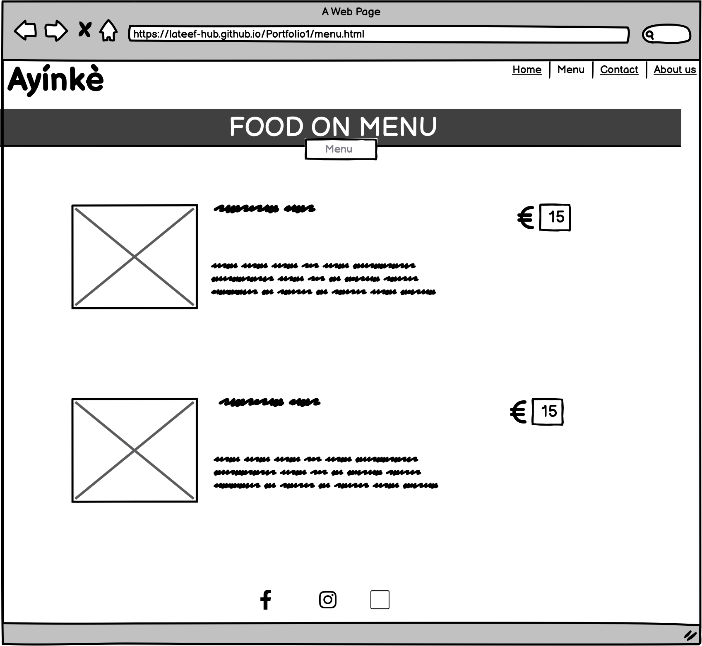
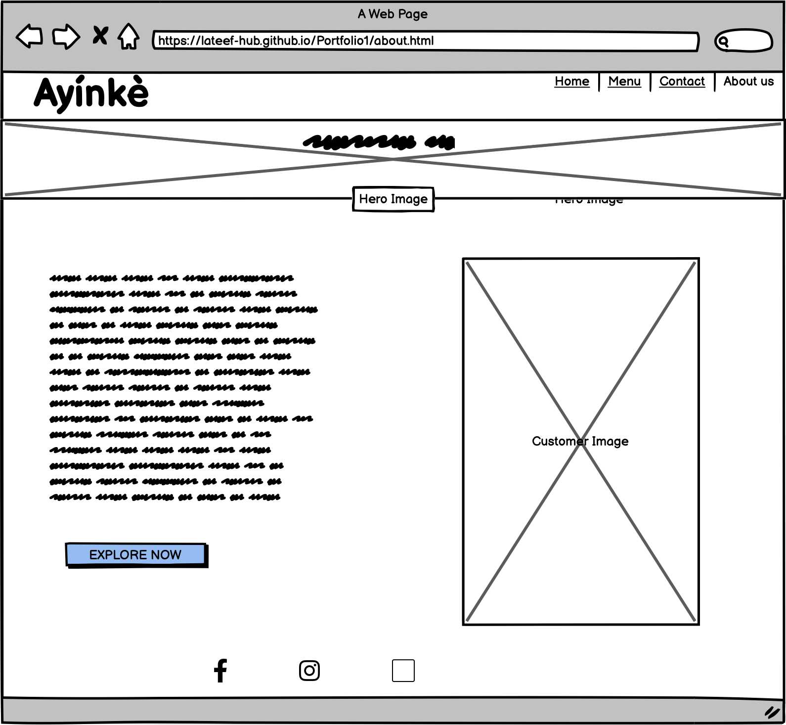
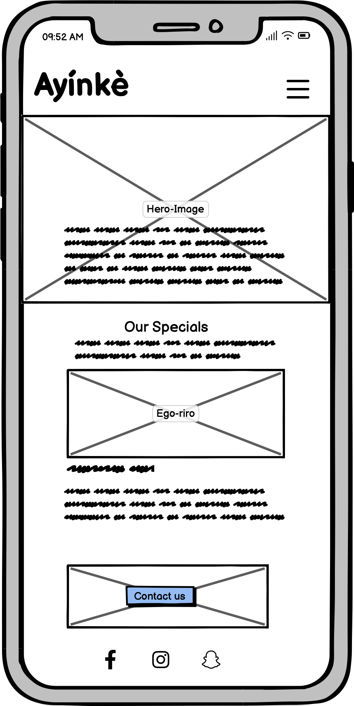
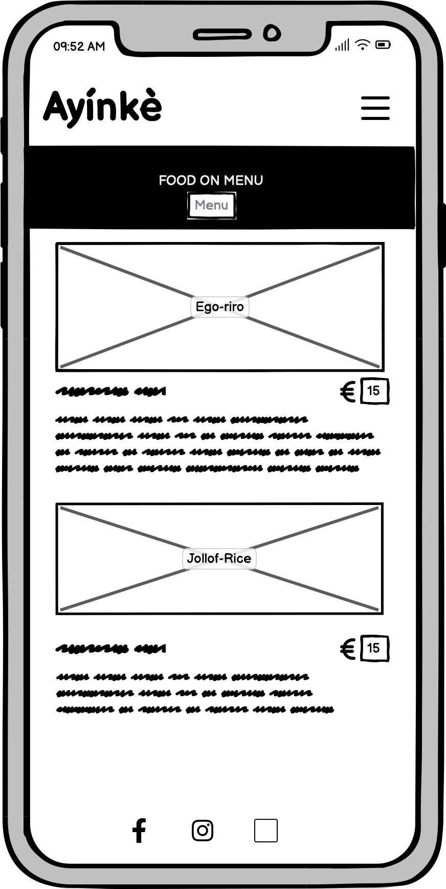
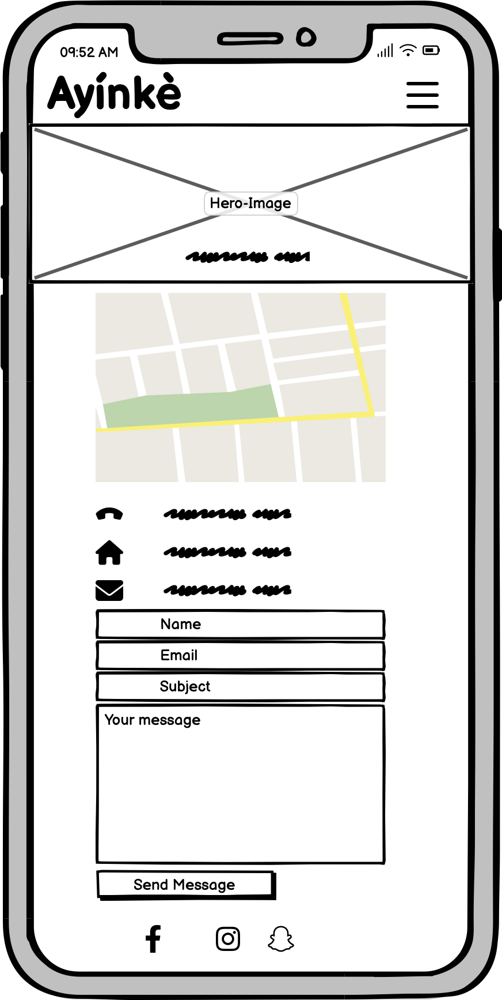
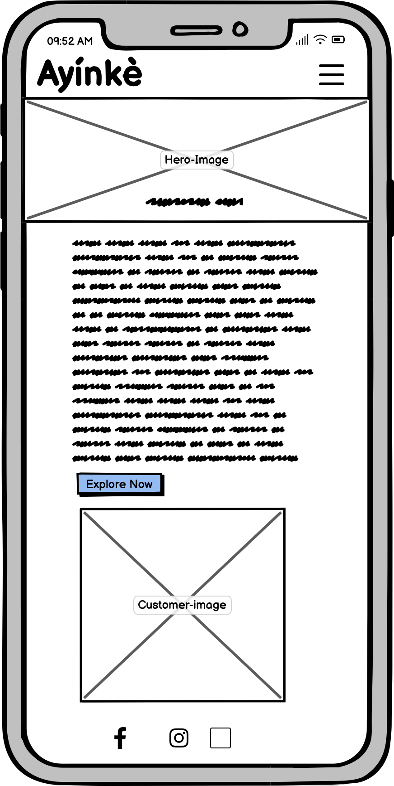
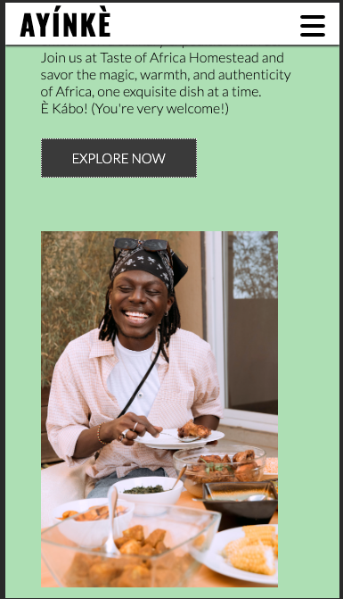

 <h1 align="center">Ayínkè African Restaurant</h1>

[View the live project here.](https://lateef-hub.github.io/Portfolio1/)

This is an African Restaurant website for Ayínkè African Restaurant. It is designed to be responsive and accessible on a different devices, making it easy to navigate for potential customers to order their choice of African food as well as view Menu.

<h2 align="center"></h2>

## User Experience (UX)

-   ### User stories

    -   #### First Time Visitor Goals

        1. As a First Time Visitor, I want to easily understand the main purpose of the site and learn more about the restaurant.
        2. As a First Time Visitor, I want to be able to easily navigate throughout the site to find contact and menu.

    -   #### Returning Visitor Goals

        1. As a Returning Visitor, I want to find information about new menu included.
        2. As a Returning Visitor, I want to find the best way to get in contact with the restaurant with any questions I may have.

    -   #### Frequent User Goals
        1. As a Frequent User, I want to check to see if my favorite food has been added.
        2. As a Frequent User, I want to check to see if the restaurant now offers discount.
        3. As a Frequent User, I want to sign up to the Newsletter so that I am emailed any major updates and/or changes to the website or restaurant.

-   ### Design
    -   #### Colour Scheme
        -   The three main colours used are Jaded Ice, black, and white.
    -   #### Typography
        -   The Lato font is the main font used throughout the whole website with Sans Serif as the fallback font in case for any reason the font isn't being imported into the site correctly. Lato is an excellent choice for web designers looking for a versatile, modern font with a friendly feel., so it is both attractive and appropriate.
    -   #### Imagery
        -   Imagery is important. The large, background hero image is designed to be striking and catch the user's attention. It also has a modern, energetic aesthetic.
        -   The Menu, Specials and customer image are designed to be precise and reflect the website goals

*   ### Wireframes

    -   Large Screen Wireframe
    -   
        -    
    -   Mobile Screen Wireframe
        -    


     ## Features

       - Responsive on all devices
       - Allows user to reach out to owner through form

     ### Future Features 
       - User will be able to order multiple item at time by using the add to cart feature

     ## Technologies Used

     ### Languages Used

       -   [HTML5](https://en.wikipedia.org/wiki/HTML5)
       -   [CSS3](https://en.wikipedia.org/wiki/Cascading_Style_Sheets)
 
     ### Frameworks, Libraries & Programs Used

      1. [Google Fonts:](https://fonts.google.com/)
        - Google fonts were used to import the 'Lato' font into the style.css file which is used on all pages throughout the project.
      1. [Font Awesome:](https://fontawesome.com/)
        - Font Awesome was used on all pages throughout the website to add icons for aesthetic and UX purposes.
      1. [Balsamiq:](https://balsamiq.com/)
        - Balsamiq was used to create the [wireframes](https://github.com/) during the design process.

 
     ## Testing
     
       ### Code validation
    
    The W3C Markup Validator and W3C CSS Validator Services were used to validate every page of the project to ensure there were no syntax errors in the project.
      -   [W3C HTML Markup Validator](https://jigsaw.w3.org/css-validator/#validate_by_input) - 
      -   [W3C CSS Validator](https://jigsaw.w3.org/css-validator/#validate_by_input) - 
       
    Lighthouse report generator was used to validate the Performance, SEO, Accesibility, Best Practices for mobile and desktop.
       
      

-  ### Test cases (user story based with screenshots)
      
      -   #### First Time Visitor Goals

    1. As a First Time Visitor, I want to easily understand the main purpose of the site and learn more about the restaurant.

        1. Upon entering the site, users are automatically greeted with a clean and easily readable navigation bar to go to the page of their choice. Underneath there is a Hero Image with Text that states the restaurant mission goal.
        2. The main points are made immediately with the hero image that this is a food restaurant website and the area we currently service
        3. The user has two options, click the navigation bar on the right or scroll down to call to action, both of which will lead to the same place, to learn more about the organisation.

    2. As a First Time Visitor, I want to be able to easily be able to navigate throughout the site to find content.

        1. The site has been designed to be fluid and never to entrap the user. At the top of each page there is a clean navigation bar, each link describes what the page they will end up at clearly.
        2. At the bottom of the first and last page there is a redirection call to action button to ensure the user always has somewhere to go and doesn't feel trapped as they get to the bottom of the page.
        - Call to Action first and last page
         
        
        3. On the Contact Us Page, after a form response is submitted, the page refreshes and the user is brought to the top of the page where the navigation bar is with message confirming the form has 
           been successfully submitted.
           

    3. As a First Time Visitor, I also want to locate their social media links to see their following on social media to determine how trusted and known they are.
        1. Once the new visitor has read the About Us and What We Do text, they will notice the Why We are Loved So Much section.
        2. The user can also scroll to the bottom of any page on the site to locate social media links in the footer.
        3. At the bottom of the Contact Us page, the user is told underneath the form, that alternatively they can contact the restaurant on social media which highlights the links to them.

-   #### Returning Visitor Goals

    1. As a Returning Visitor, I want to find the new menu added.

        1. These are clearly shown in the banner message.
        2. They will be directed to a page with another hero image and call to action.

    2. As a Returning Visitor, I want to find the best way to get in contact with the organisation with any questions I may have.

        1. The navigation bar clearly highlights the "Contact Us" Page.
        2. Here they can fill out the form on the page or are told that alternatively they can message the organisation on social media.
        3. The footer contains links to the organisations Facebook, Snapchat and Instagram page.
        4. Whichever link they click, it will be open up in a new tab to ensure the user can easily get back to the website.
        5. The email button is set up to automatically open up your email app and autofill there email address in the "To" section.

    3. As a Returning Visitor, I want to find the Facebook Group link so that I can join and interact with others in the community.
        1. The Facebook Page can be found at the footer of every page and will open a new tab for the user and more information can be found on the Facebook page.
-   #### Frequent User Goals
    1. As a Frequent User, I want to check to see if there are any newly added menu or locations.
        1. The user would already be comfortable with the website layout and can easily click the menu from the nav bar or call to action from contact page.

        ### Fixed Bugs

        - The responsiveness of the page on iPad screen was a little bit bad and needed alignment
        
-  ## Supported Screens and Browsers

        
    ### Further Testing

   -   The Website was tested on Google Chrome, Internet Explorer, Mozilla Firefox, Microsoft Edge and Safari browsers.
   -   The website was viewed on a variety of devices such as Desktop, Laptop, iPhone xr,   Samsung Tablet, iPhone 12 & iPhoneX.
   -   A large amount of testing was done to ensure that all pages were linking correctly.
   -   Friends and family members were asked to review the site and documentation to point out any bugs and/or user experience issues.
## Deployment

### GitHub Pages

The project was deployed to GitHub Pages using the following steps...

1. Log in to GitHub and locate the [GitHub Repository](https://github.com/)
2. At the top of the Repository (not top of page), locate the "Settings" Button on the menu.
    - Alternatively Click [Here](https://raw.githubusercontent.com/) for a GIF demonstrating the process starting from Step 2.
3. Scroll down the Settings page until you locate the "GitHub Pages" Section.
4. Under "Source", click the dropdown called "None" and select "Master Branch".
5. The page will automatically refresh.
6. Scroll back down through the page to locate the now published site [link](https://github.com) in the "GitHub Pages" section.

### Forking the GitHub Repository

By forking the GitHub Repository we make a copy of the original repository on our GitHub account to view and/or make changes without affecting the original repository by using the following steps...

1. Log in to GitHub and locate the [GitHub Repository](https://github.com/)
2. At the top of the Repository (not top of page) just above the "Settings" Button on the menu, locate the "Fork" Button.
3. You should now have a copy of the original repository in your GitHub account.

### Making a Local Clone

1. Log in to GitHub and locate the [GitHub Repository](https://github.com/)
2. Under the repository name, click "Clone or download".
3. To clone the repository using HTTPS, under "Clone with HTTPS", copy the link.
4. Open Git Bash
5. Change the current working directory to the location where you want the cloned directory to be made.
6. Type `git clone`, and then paste the URL you copied in Step 3.

```
$ git clone https://github.com/YOUR-USERNAME/YOUR-REPOSITORY
```

7. Press Enter. Your local clone will be created.

```
$ git clone https://github.com/YOUR-USERNAME/YOUR-REPOSITORY
> Cloning into `CI-Clone`...
> remote: Counting objects: 10, done.
> remote: Compressing objects: 100% (8/8), done.
> remove: Total 10 (delta 1), reused 10 (delta 1)
> Unpacking objects: 100% (10/10), done.
```

Click [Here](https://help.github.com/en/github/creating-cloning-and-archiving-repositories/cloning-a-repository#cloning-a-repository-to-github-desktop) to retrieve pictures for some of the buttons and more detailed explanations of the above process.


## Credits

  ### Code

-   The full-screen hero image code came from this [Wttw post](https://interactive.wttw.com/playlist/2022/10/13/dozzys-grill)

### Content

-   All content was written by the developer.

-   Psychological properties of colours text in the README.md was found [here](http://www.colour-affects.co.uk/psychological-properties-of-colours)

### Media

-   All Images were created by the developer.

### Acknowledgements

-   My Mentor for continuous helpful feedback.
 
-   Tutor support at Code Institute for their support.
  
-   Kevin Powell CSS Tutorial Class (Youtube)
